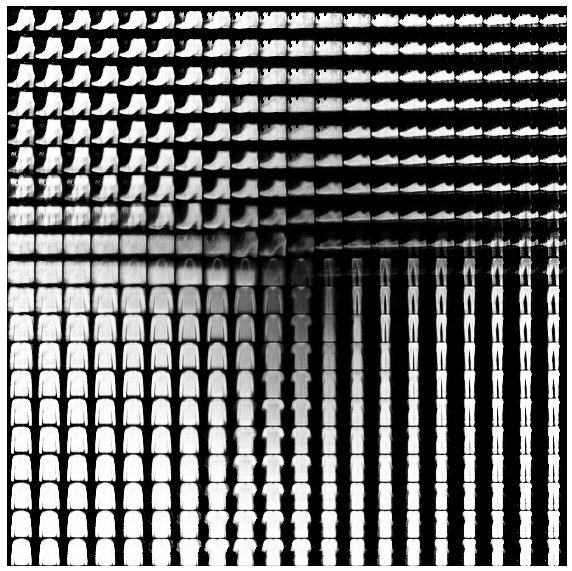

# TensorFlow.js: Training a variational autoencoder.

This example shows you how to train a [variational autoenconder](https://blog.keras.io/building-autoencoders-in-keras.html) using TensorFlow.js on Node.

The model will be trained on the [Fashion MNIST](https://github.com/zalandoresearch/fashion-mnist) dataset.

This example is a port of the code for a multilayer perceptron based variational
autoencoder from this link https://github.com/keras-team/keras/blob/master/examples/variational_autoencoder.py See [this tutorial](https://blog.keras.io/building-autoencoders-in-keras.html) for a description of how autoencoders work.

## Prepare the node environment:
```sh
$ yarn
# Or
$ npm install
```

In the instructions below you can replace ```yarn``` with ```npm run``` if you do not have yarn installed.

## Download the data

You can run ```yarn download-data``` or follow the instructions below t download it manually.

Download the [train-images-idx3-ubyte.gz](http://fashion-mnist.s3-website.eu-central-1.amazonaws.com/train-images-idx3-ubyte.gz) from [this page](https://github.com/zalandoresearch/fashion-mnist#get-the-data).

Uncompress the file and put the resulting `train-images-idx3-ubyte`. Into a folder called `dataset` within this example folder.

## Run the training script:
```sh
$ yarn train
```

or if you have CUDA installed you can use

```sh
$ yarn train --gpu
```

It will display a preview image after every epoch and will save the model at the end of training.

If you are running on a Linux system that is [CUDA compatible](https://www.tensorflow.org/install/install_linux), try using the GPU
package. To do so, replace `require('@tensorflow/tfjs-node')` with `require('@tensorflow/tfjs-node-gpu');` in main.js

## Serve the model

Once the training is complete run

```sh
yarn serve-model
```

to serve the model

## View the results

In another terminal run 

```sh
yarn serve-client
```

To start up the client once it loads you should see an image like the one below after a few seconds.

